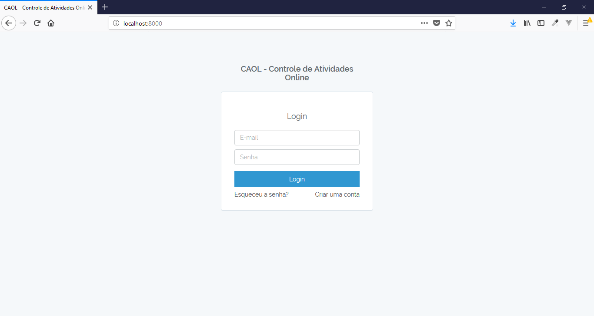
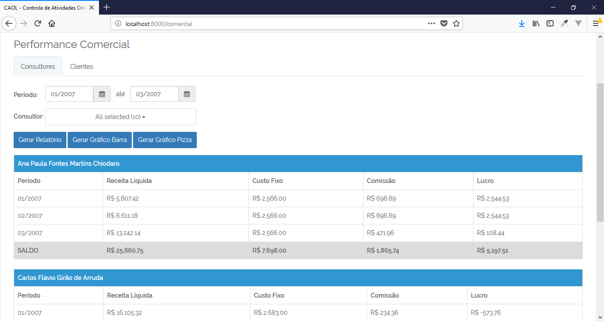
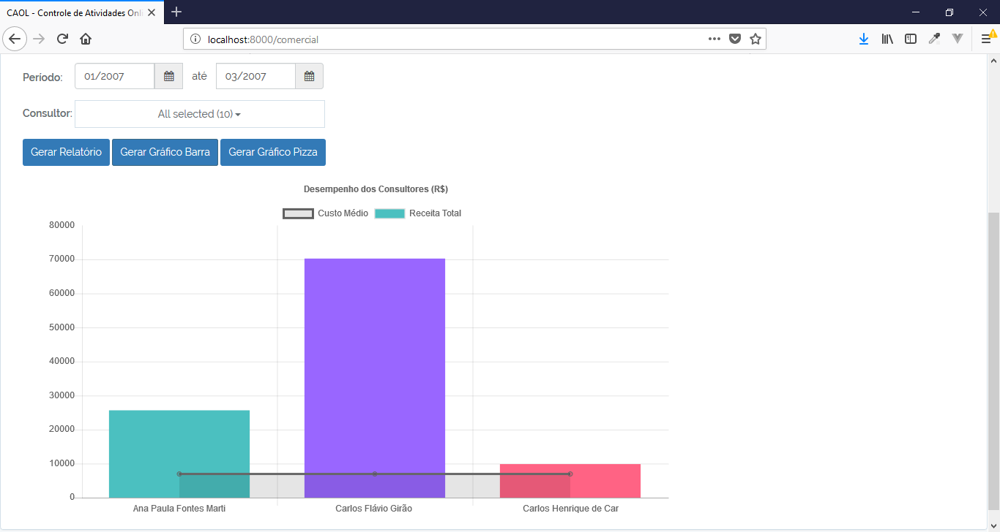
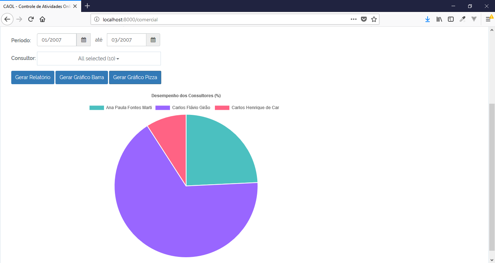
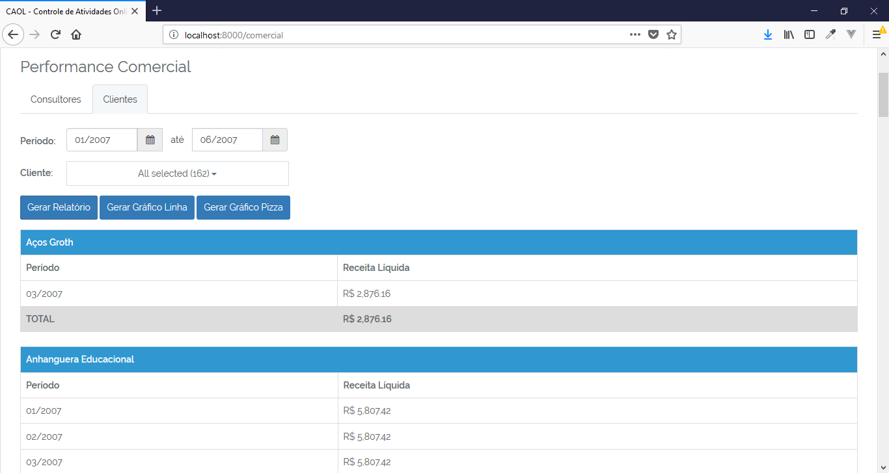
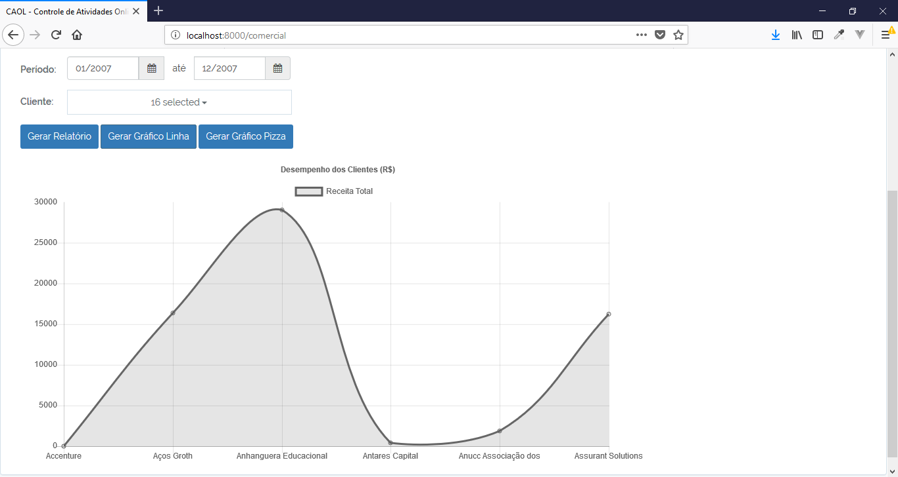
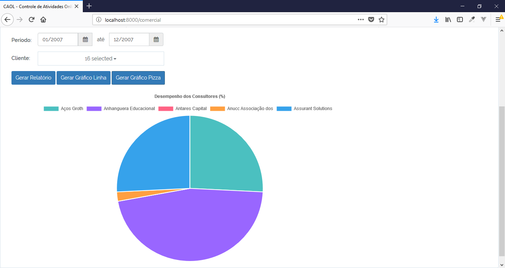

# PERFORMANCE COMERCIAL

Prova da empresa Agence desenvolvida em PHP utilizando framework Laravel.

## Características

- OAuth
- Login
- Routes
- Filter
- View Blade

## Requisitos

- Apache
- PHP >= 7
- MySql >=5
- Composer

## Tecnologias

- PHP
- JS
- Jquery
- CSS
- Bootstrap
- ChartJS
- Composer
- Artisan

## Instalação

```
$ git clone https://github.com/danilomeneghel/prova_agence.git

$ cd prova_agence

$ composer install
```

Crie um banco de dados com o nome "caol" no seu Mysql. <br>
Você encontra o dump na raiz do projeto (caol.sql) e pode efetuar importação da seguinte forma:

```
$ mysql -u <your user> -p <your password>

mysql> create database `caol`;

mysql> use `caol`;

mysql> source caol.sql
```

Volte o terminal, verifique o arquivo .env e efetue a configuração correta para conexão do seu banco de dados.<br>

Depois de realizado isso, rode o projeto:

```
$ php artisan serve
```

Abra em seu navegador: <br> 

http://localhost:8000/

## Login 

Para poder se logar no sistema é só criar um novo usuário clicando no link "Criar uma conta".

Ou pode logar usuando o usuário Admin já cadastrado: <br>

	- Usuário: admin@admin.com
	- Senha: 1234

## Demonstração

Para ver o sistema rodando online basta acessar o link abaixo: <br>

http://provaagence.herokuapp.com

## License

Performance Comercial está sob a licença <a href="LICENSE">The MIT License (MIT)</a>.

## Screenshots

<br><br>
<br><br>
<br><br>
<br><br>
<br><br>
<br><br>
<br><br>
<br><br>
