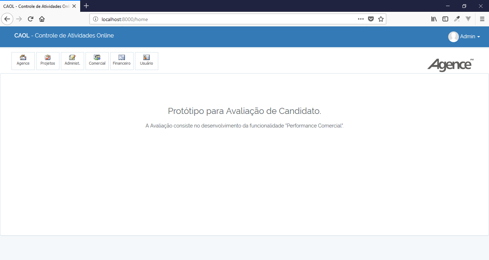

# PERFORMANCE COMERCIAL

Prova da empresa Agence desenvolvida em PHP utilizando framework Laravel.

## Features

- OAuth
- Login
- Routes
- Filter
- View Blade

## Requirements

- Apache
- PHP >= 5.5.9
- MySql >=5
- Composer

## Tecnologies

- PHP
- JS
- Jquery
- CSS
- Bootstrap
- ChartJS
- Composer
- Artisan

## Installation

```
$ git clone https://github.com/danilomeneghel/prova_agence.git

$ cd angularjs_laravel

$ composer install
```

Crie um banco de dados com o nome "caol" em seu MySql.
Depois rode o seguinte comando:

```
$ mysql -u <your user> -p <your password>

mysql> create database `caol`;
```

Volte o terminal, verifique o arquivo .env e efetue a configuração correta para conexão do seu banco de dados e depois rode o Artisan:

```
$ php artisan key:generate

$ php artisan migrate

$ php artisan db:seed
```

Depois de realizado isso, rode o projeto:

```
$ php artisan serve
```

Finalmente abra http://localhost:8000/ em seu navegador.

## License

Performance Comercial está sob a licença <a href="LICENSE">The MIT License (MIT)</a>.

## Screenshots

<br><br>
<br><br>
<br><br>
<br><br>
<br><br>
<br><br>
<br><br>
<br><br>
